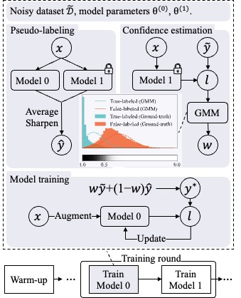

# Robust-LR
# Two Wrongs Don’t Make a Right:Combating Confirmation Bias in Learning with Label Noise (PyTorch)

## Experiments

run RoLR.py, such as

     $ python RoLR.py --data_path path-to-your-dataset --num_class 10 --dataset cifar10 --num_epochs 500 --gpuid 0 --lambda_p 2 --T 1 --r 0.8

## Requirements

- Python >= 3.6
- PyTorch >= 1.6
- CUDA
- Numpy

## Reference
We thank the implementation of DivideMix and FixMatch in:
* ["https://github.com/LiJunnan1992/DivideMix"](https://github.com/LiJunnan1992/DivideMix),
* ["https://github.com/LeeDoYup/FixMatch-pytorch"](https://github.com/LeeDoYup/FixMatch-pytorch).
